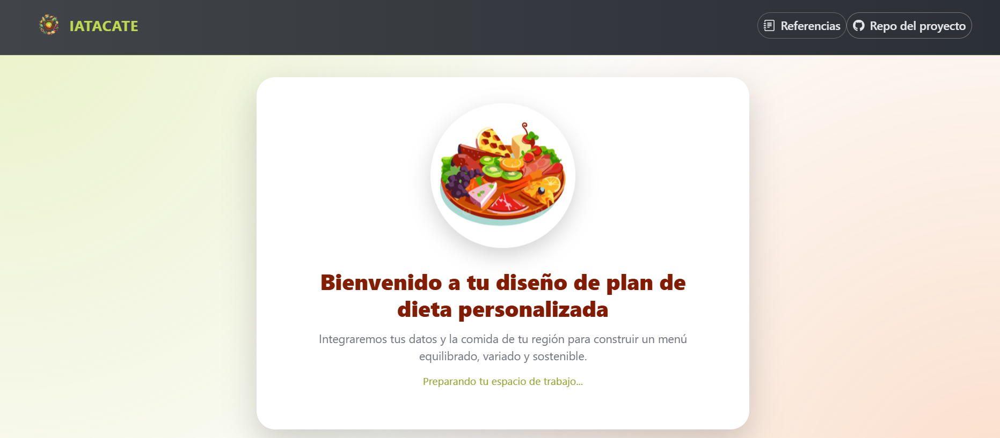
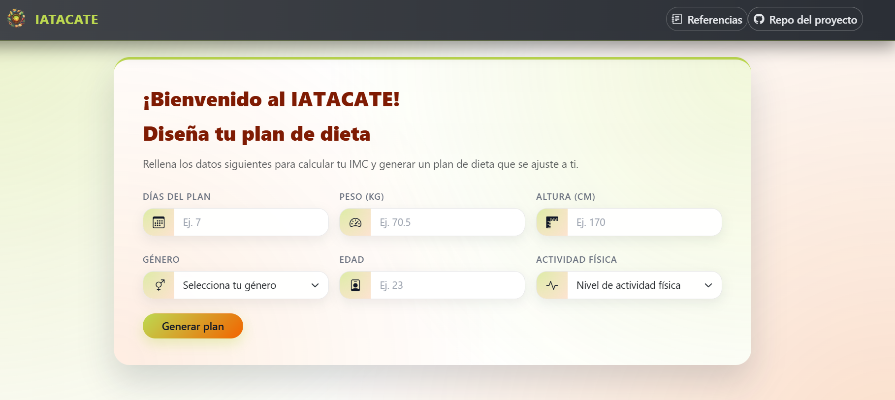
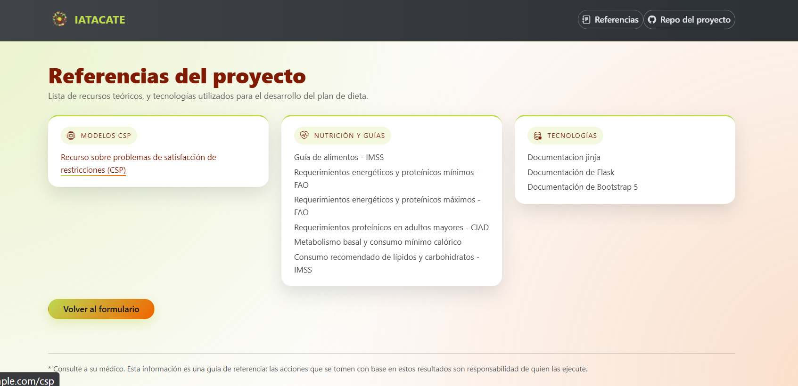
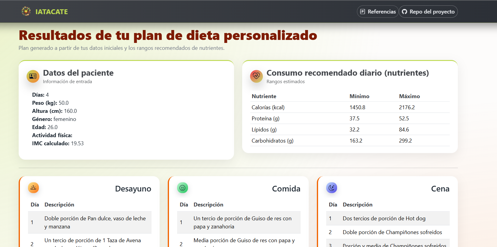

# IATACATE - Generador de planes de dieta con IA

IATACATE es una aplicación web desarrollada con **Flask** que genera planes de dieta personalizados a partir de datos básicos del usuario, como peso, altura, edad, género, actividad física y número de días del plan.

El sistema calcula el IMC y rangos nutricionales recomendados, después selecciona combinaciones de platillos que cumplan restricciones de calorías, proteína, lípidos y carbohidratos.

---

## Pipeline de IA usado

Este proyecto no usa una API externa de IA ni un modelo generativo. La inteligencia artificial implementada corresponde a un enfoque clásico de **búsqueda y optimización basado en restricciones**.

El pipeline real del sistema es:

```text
Datos del usuario
        ↓
Validación y lectura desde el formulario Flask
        ↓
Cálculo de IMC y requerimientos nutricionales
        ↓
Construcción del problema como CSP
        ↓
Selección de platillos con backtracking
        ↓
Heurística MRV para elegir la variable con menor dominio
        ↓
Consistencia de arcos / poda de valores no válidos
        ↓
Generación de un plan alimenticio factible
        ↓
Optimización con recocido simulado
        ↓
Visualización del plan final en la interfaz web
```

### Componentes principales del pipeline

| Etapa | Descripción |
|---|---|
| Entrada de datos | El usuario ingresa días, peso, altura, edad, género y actividad física. |
| Cálculo nutricional | Se calcula IMC, calorías mínimas/máximas, proteína, lípidos y carbohidratos. |
| CSP | El menú se modela como un problema de satisfacción de restricciones. |
| Backtracking | Busca combinaciones válidas de desayuno, comida y cena. |
| MRV | Elige primero la variable con menor cantidad de opciones disponibles. |
| Consistencia de arcos | Reduce dominios descartando platillos que exceden límites máximos. |
| Recocido simulado | Intenta mejorar el plan reduciendo costo y repeticiones de platillos. |
| Salida | Muestra el plan final en tablas dentro de la aplicación web. |

Archivos principales relacionados con la IA:

```text
app/core/modelo_csp.py   # Cálculo nutricional, CSP, backtracking y recocido simulado
app/core/catalogo.py     # Catálogo de platillos usado por el modelo
app/routes.py            # Conecta el formulario con el motor de generación del plan
```

---

## Tecnologías utilizadas

- Python
- Flask
- Pandas
- NumPy
- Jinja2
- Bootstrap 5
- HTML, CSS y JavaScript
- CSV como fuente de datos local

---

## Estructura del proyecto

```text
proyectoDieta-main/
├── app/
│   ├── core/
│   │   ├── catalogo.py
│   │   └── modelo_csp.py
│   ├── static/
│   │   ├── css/
│   │   ├── img/
│   │   └── js/
│   ├── templates/
│   ├── __init__.py
│   └── routes.py
├── data/
│   └── BD_JUNTA.csv
├── docs/
│   └── screenshots/
├── requirements.txt
├── run.py
└── README.md
```

---

## Instalación

Clona el repositorio:

```bash
git clone https://github.com/ArianaST/proyectoDieta.git
cd proyectoDieta
```

Crea un entorno virtual:

```bash
python -m venv venv
```

Activa el entorno virtual.

En Windows:

```bash
venv\Scripts\activate
```

En macOS/Linux:

```bash
source venv/bin/activate
```

Instala dependencias:

```bash
pip install -r requirements.txt
```

Ejecuta la aplicación:

```bash
python run.py
```

Abre en el navegador:

```text
http://127.0.0.1:5000
```

---

## Capturas de pantalla

### Pantalla de bienvenida



### Formulario de datos



### Referencias del proyecto



### Resultados del plan alimenticio




---

## Aviso

Este sistema es una herramienta de apoyo académico. La información generada no sustituye la valoración de un profesional de la salud o nutrición.
